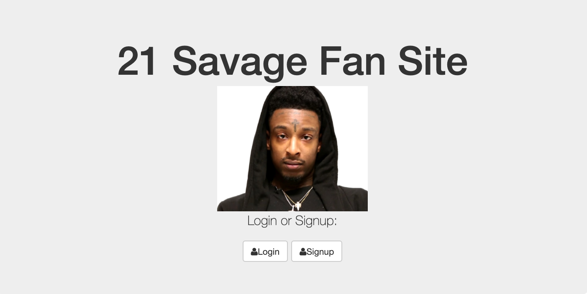

# Savage Express App

Create an app where users can post messages to 21 Savage fan board.

### Development:
**Languages Used:** HTML, CSS, JavaScript, Node, Express, EJS template, MongoDB
First time using EJS and MongoDB to allow users to write on the message board

### Optimizations:
Need to finish the final edits to each page

#### Installation

1. Clone repo
2. run `npm install`

#### Usage

1. run `npm run savage`
2. Navigate to `localhost:3000`
